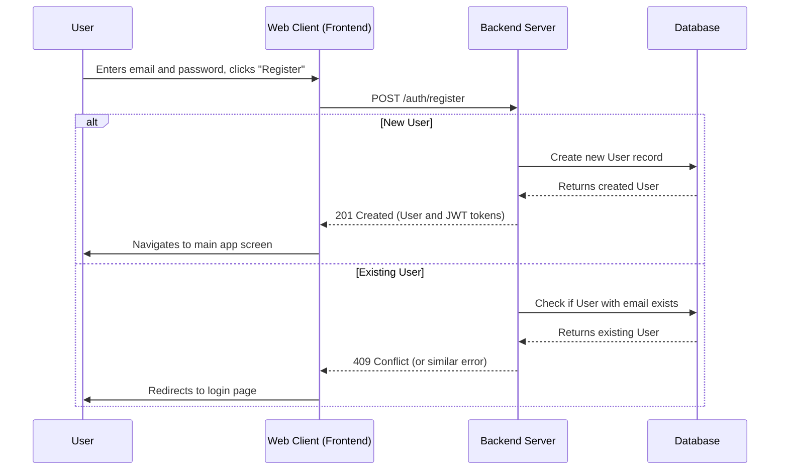
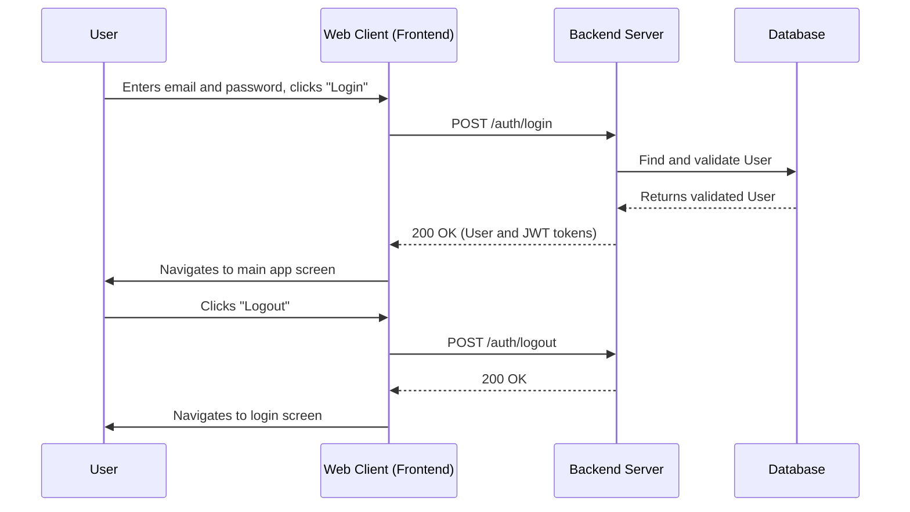
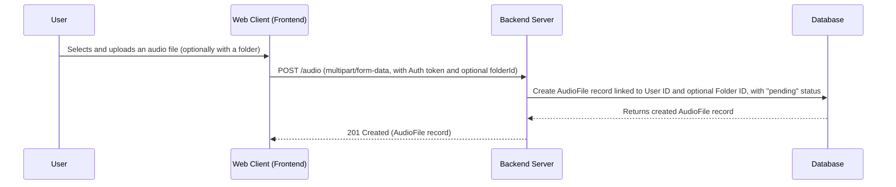
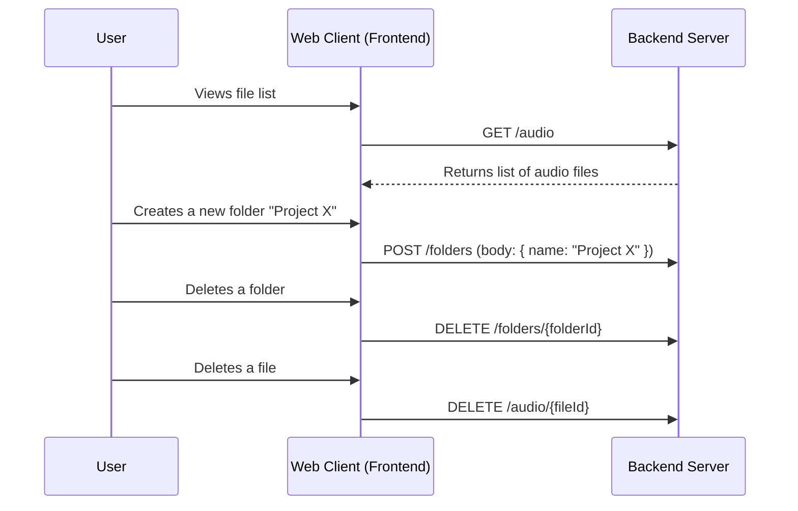
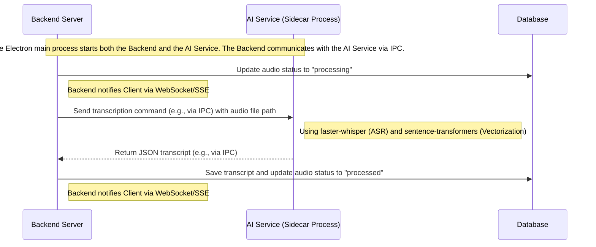
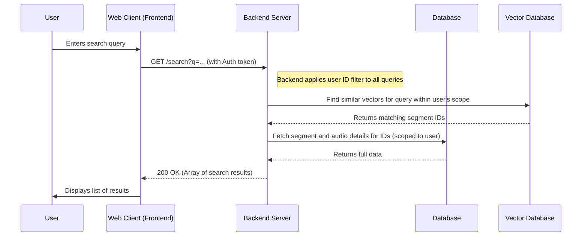
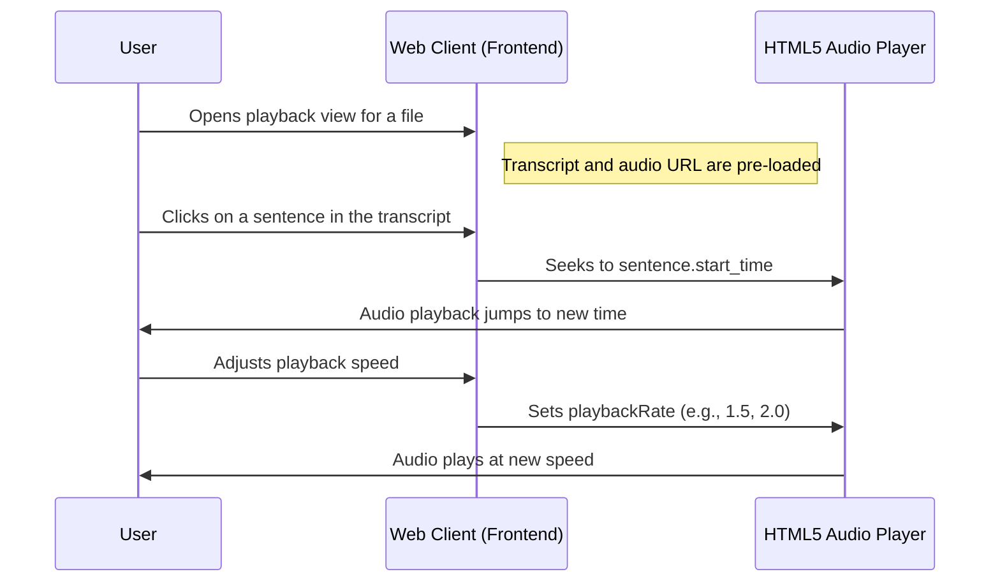
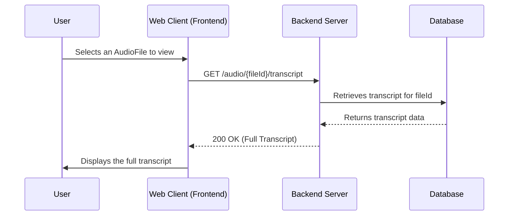
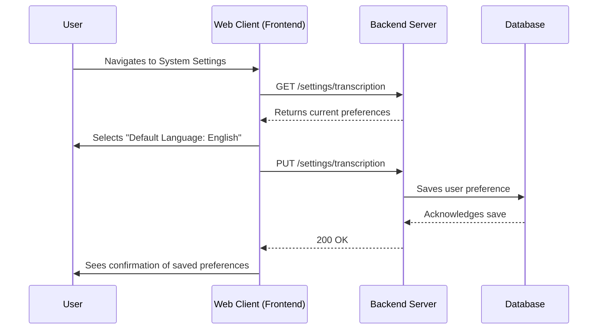
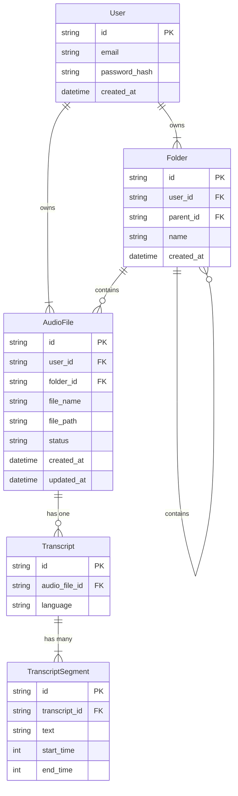

# Feature Specification: MVP Audio Search

**Feature Branch**: `001-mvp-audio-search`  
**Created**: 2025-12-05
**Status**: Draft  
**Input**: User description: "Implement the Minimum Viable Product for EchoMind. This includes user login, audio file upload, AI-powered transcription and semantic search, and a basic playback experience with a transcript and precise jump functionality."

## User Scenarios & Testing *(mandatory)*

### User Story 1 - User Registration (Priority: P1)

As a new user, I want to create an account so that I can securely access the application.

**Why this priority**: User accounts are fundamental for data isolation and a personalized experience.

**Independent Test**: A user can register for a new account. A second user can register with a different email.

**Acceptance Scenarios**:

1.  **Given** I am on the registration screen, **When** I provide valid new user credentials and click "Register", **Then** I am logged in and taken to the main application view.
2.  **Given** I try to register with an email that already exists, **When** I click "Register", **Then** I am redirected to the login route.

---

### User Story 2 - User Login & Logout (Priority: P1)

As a returning user, I want to log in and out of the application to manage my session.

**Why this priority**: Secure access to the application is a core requirement.

**Independent Test**: A registered user can log in and log out successfully.

**Acceptance Scenarios**:

1.  **Given** I am a registered user on the login screen, **When** I provide my correct credentials, **Then** I am logged in and taken to the main application view.
2.  **Given** I am on the login screen, **When** I provide incorrect credentials, **Then** I see an error message.
3.  **Given** I am logged in, **When** I click "Logout", **Then** I am returned to the login screen.

---

### User Story 3 - File Upload (Priority: P2)

As a logged-in user, I want to upload an audio file, optionally assigning it to a folder, so it can be processed by the system.

**Why this priority**: This is the foundational content creation step. Without uploaded audio, no other feature has value.

**Independent Test**: Can be tested by uploading an audio file and verifying it is saved by the system.

**Acceptance Scenarios**:

1.  **Given** I am logged in, **When** I select and upload a valid audio file, **Then** the file is successfully uploaded and is pending transcription.
2.  **Given** I am logged in and have a folder, **When** I select and upload a valid audio file and assign it to the folder, **Then** the file is successfully uploaded into that folder.
3.  **Given** I attempt to upload an unsupported file type, **When** the upload is attempted, **Then** I see an error message.

---

### User Story 4 - File Management (Priority: P3)

As a user, I want to see a list of my uploaded files and organize them with folders so I can easily find and manage my recordings.

**Why this priority**: Organization is key to managing a large library of recordings.

**Independent Test**: A user can see their uploaded files. They can create a folder. They can upload a file into that folder. They can delete a file and a folder.

**Acceptance Scenarios**:

1.  **Given** I have uploaded files, **When** I view my file list, **Then** I see a list of my files with their status (e.g., pending, processing, processed).
2.  **Given** I am viewing my file list, **When** I create a new folder, **Then** the folder appears in my file list.
3.  **Given** I have a file, **When** I delete the file, **Then** it is removed from my file list.
4.  **Given** I have a folder, **When** I delete the folder, **Then** it is removed from my file list.
*Note: Files are assigned to folders upon upload. There is no functionality to move a file between folders after it has been uploaded.*

---

### User Story 5 - Audio Transcription (Priority: P2)

As a user, I want my uploaded audio files to be automatically transcribed so I can search and review their content.

**Why this priority**: Transcription is the core process that enables search and playback features.

**Architecture**: The AI transcription service runs as a long-running "sidecar" process, managed by the main backend application. This avoids per-job startup overhead and simplifies deployment. The backend communicates with the AI service over a standard inter-process communication (IPC) channel.

**Independent Test**: Can be tested by observing an audio file in the "pending" state and verifying it moves to "processed" with a complete transcript.

**Acceptance Scenarios**:

1.  **Given** a file has a "pending" status, **When** the transcription process is complete, **Then** the file status updates to "processed" and the transcript is available.

2.  **Given** a transcription job fails, **Then** the file status updates to "error".

---

### User Story 7 - Semantic Search (Priority: P3)

As a logged-in user, I want to search for a concept or phrase and find the exact moments it was mentioned in *my* audio files.

**Why this priority**: This is the core value proposition of the application, solving the user's primary pain point of manually scrubbing through recordings.

**Independent Test**: Can be tested by executing a search query and verifying that the system returns relevant, clickable segments from the transcript, and that results are only from the logged-in user's files.

**Acceptance Scenarios**:

1.  **Given** I have at least one processed audio file, **When** I enter a search term into the search bar, **Then** I see a list of transcript segments that are semantically related to my query, from my files only.
2.  **Given** search results are displayed, **When** I click on a result, **Then** I am taken to the playback view with the audio cued to the start of that segment.

---

### User Story 8 - Transcript and Playback Interaction (Priority: P4)

As a user, I want to interact with the transcript to control audio playback and listen to specific parts of a recording, including adjusting playback speed.

**Why this priority**: Enhances the review process, making it much faster and more intuitive than using a simple audio player.

**Independent Test**: Can be tested by opening the playback view for a processed file and clicking on different sentences in the transcript, as well as adjusting the playback speed.

**Acceptance Scenarios**:

1.  **Given** I am in the playback view, **When** I click on any sentence in the transcript, **Then** the audio playback immediately jumps to the corresponding time.
2.  **Given** audio is playing, **When** I use the playback controls, **Then** I can play, pause, and adjust the playback speed (e.g., 1.5x, 2x).

---

### User Story 9 - Transcript View (Priority: P4)

As a user, I want to view the full transcribed text of an audio file so I can read its content.

**Why this priority**: Providing a clear view of the complete transcript is fundamental for understanding the audio content.

**Independent Test**: A user can open a processed audio file and see its complete, well-formatted transcript.

**Acceptance Scenarios**:

1.  **Given** I have a processed audio file, **When** I select to view it, **Then** the full transcribed text is displayed clearly.

---

### User Story 10 - Transcription Preferences (System Settings) (Priority: P4)

As a user, I want to configure transcription preferences, such as the default language, within the system settings, so that my audio files are transcribed according to my needs.

**Why this priority**: Customization of transcription is important for accuracy and user experience.

**Independent Test**: A user can change their default transcription language in the settings, and a subsequent audio upload is transcribed using that language.

**Acceptance Scenarios**:

1.  **Given** I am in the System Settings, **When** I navigate to Transcription Preferences, **Then** I can view and modify the default transcription language.
2.  **Given** I have saved a new default transcription language, **When** I upload a new audio file, **Then** the file is transcribed using the newly selected language.

---

### Edge Cases

-   What happens when an audio file is uploaded but the transcription process fails? The file status should indicate an error.
-   How does the system handle very long audio files (e.g., 3+ hours)? The process should not block the UI.
-   How does the system handle audio files with poor quality or significant background noise? The transcript may have lower accuracy, which is acceptable for MVP.
-   What happens if a search query returns no results? The system should display a "no results found" message.
-   What happens if a user tries to access a resource that does not belong to them? The system MUST return a 403 Forbidden or 404 Not Found error.
-   What happens if a user's session token expires? The client application MUST redirect the user to the login screen.

## Requirements *(mandatory)*

### Functional Requirements

-   **FR-001**: The system MUST allow a new user to register with an email and password.
-   **FR-002**: The system MUST allow a registered user to log in and log out.
-   **FR-003**: The system MUST secure endpoints, ensuring a user can only access their own data.
-   **FR-004**: The system MUST allow a logged-in user to upload one audio file at a time, optionally assigning it to a folder.
-   **FR-005**: The system MUST allow the user to view their uploaded audio files and folders.
-   **FR-006**: The system MUST allow a user to create and delete folders.
-   **FR-007**: The system MUST allow a user to delete their audio files.
-   **FR-008**: The system MUST automatically generate a time-stamped text transcript from the uploaded audio file.
-   **FR-009**: The system MUST generate vector representations of the transcript content for semantic search.
-   **FR-010**: The system MUST provide a search interface for users to perform semantic search on their own audio files.
-   **FR-011**: The system MUST return a list of transcript segments from the user's files that are semantically relevant to the query.
-   **FR-012**: The system MUST display the full transcript for a selected audio file.
-   **FR-013**: The system MUST allow the audio to be played, paused, and have its playback speed adjusted.
-   **FR-014**: The system MUST jump the audio playback to the correct time when a user clicks on a segment of the transcript.
-   **FR-015**: The system MUST allow the user to configure the default language for transcription within the system settings.
-   **FR-016**: The system MUST use `faster-whisper` for ASR and `sentence-transformers` for vectorization.

### Key Entities

-   **User**: Represents an application user with credentials.
-   **Folder**: Represents a folder to organize audio files, can be nested.
-   **AudioFile**: Represents an audio recording uploaded by a **User**. Key attributes include a unique identifier, file name, processing status, and a link to its transcript.
-   **Transcript**: Represents the full text content of an `AudioFile`. It is composed of multiple segments.
-   **TranscriptSegment**: Represents a small, contiguous portion of a transcript (e.g., a sentence) with associated start and end times. It also has a vector representation for search purposes.

## Success Criteria *(mandatory)*

### Measurable Outcomes

-   **SC-001**: A user can find a specific spoken phrase in a 1-hour audio file in under 60 seconds from launching the application.
-   **SC-002**: 90% of semantic search queries for concepts explicitly mentioned in the audio return the correct segment in the top 3 results.
-   **SC-003**: Clicking a transcript segment jumps the audio to the correct position with less than a 1-second delay.
-   **SC-004**: The core workflow (audio upload to searchable transcript) must complete without user error for 95% of sessions.