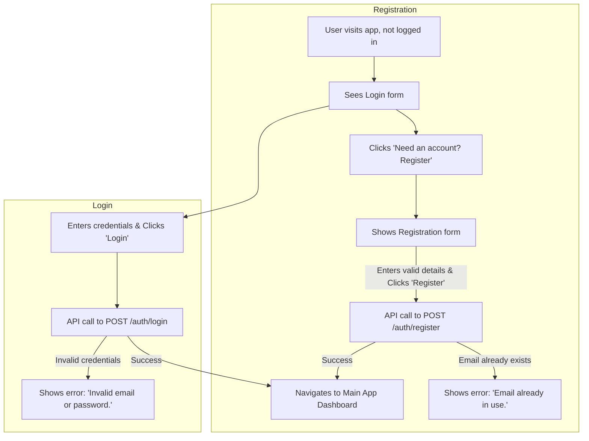
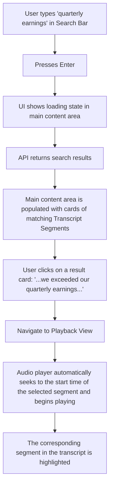
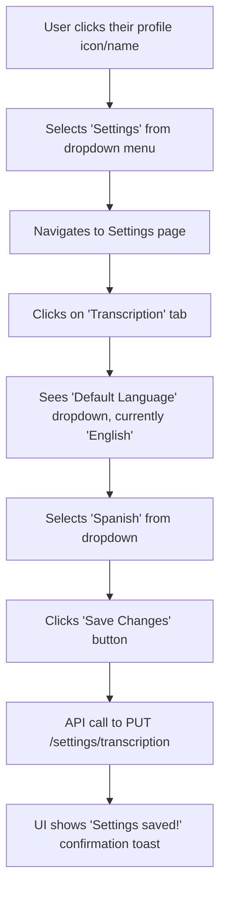
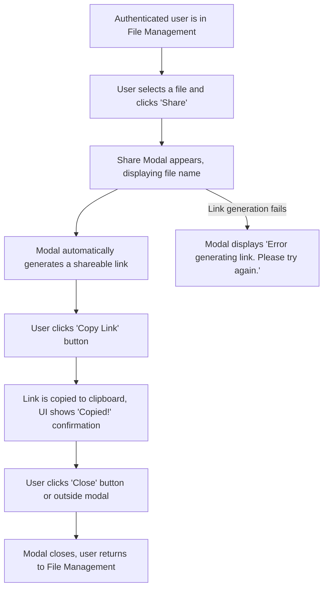

# UI/UX Specification: MVP Audio Search

## 1. Overview & Design Principles

-   **Objective**: To provide a user with a seamless and efficient way to upload, transcribe, and perform semantic search on their audio files. The UI should empower the user to find key moments in their recordings without friction.
-   **Key Principles**:
    -   **Clarity**: The interface must be immediately understandable. The state of each file (e.g., `processing`, `processed`, `error`) should be obvious.
    -   **Efficiency**: The primary user journeys—uploading a file and searching—should require the minimum number of clicks.
    -   **Consistency**: The UI will maintain a consistent design language across all views (authentication, file management, playback).
-   **Feedback**: The UI must provide clear feedback for all actions, including file uploads, search queries, and errors.

-   **Frontend Technology**: The UI will be implemented using a component-based framework and styled with **Tailwind CSS**. This utility-first approach will be used to ensure consistency and rapid development.

## 2. Wireframes & Mockups

*This section describes the layout of the key views identified in the user flows. No images are generated; this should be supplemented with designs from a tool like Figma.*

-   **View**: Authentication (Login / Register)
    -   **Reference**: Flow 1
    -   **Layout Description**: A single, centered card on a clean background. The card contains a form with "Email" and "Password" fields, a primary action button ("Login" or "Register"), and a toggle link to switch between the two forms. Error messages (e.g., "Invalid email or password") appear below the relevant field.
    -   **Link to Mockup**: [Link to Figma/Sketch/Image file for Auth View]

-   **View**: Main Application (Dashboard)
    -   **Reference**: Flows 2, 3, 4
    -   **Layout Description**: A two-column layout.
        -   **Left Sidebar**: A collapsible navigation pane showing a "Home" or "All Files" link and a hierarchical list of user-created folders. At the top is a primary "Upload" button. At the bottom is a user profile element that opens a menu with "Settings" and "Logout".
        -   **Main Content Area**: Features a prominent global Search Bar at the top. Below, it displays a grid or list of `File Card` components. This area also displays search results or the contents of a selected folder. An empty state ("You have no files yet.") or a "No results found." message will appear here when appropriate.
    -   **Link to Mockup**: [Link to Figma/Sketch/Image file for Dashboard]

-   **View**: Playback & Transcript
    -   **Reference**: Flow 4
    -   **Layout Description**: A two-column layout, ideal for wider screens.
        -   **Left Column**: A scrollable view of the full, interactive transcript. Each `Transcript Segment` is clickable. The currently playing segment is highlighted.
        -   **Right Column**: An audio player is docked at the top with controls (play/pause, speed, timeline).
    -   **Link to Mockup**: [Link to Figma/Sketch/Image file for Playback View]

-   **View**: Settings
    -   **Reference**: Flow 5
    -   **Layout Description**: A simple, form-based view, likely within a modal or a dedicated page. It would have sections for different settings. The "Transcription" section contains a label and a dropdown menu for "Default Language" and a "Save Changes" button.
    -   **Link to Mockup**: [Link to Figma/Sketch/Image file for Settings View]

-   **View**: Share Modal
    -   **Reference**: Flow for File Sharing via Modal
    -   **Layout Description**: This modal is accessible to authenticated users from the file management section. It overlays the main content area and features a prominent title ("Share File"), the file name, an input field displaying the shareable link (read-only), a "Copy Link" button, and a "Close" button. Error messages related to link generation or permissions appear within the modal.
    -   **Link to Mockup**: [Link to Figma/Sketch/Image file for Share Modal]

-   **View**: Public Share Page
    -   **Reference**: User Story 6 (Export & Share Snippets)
    -   **Layout Description**: A minimal, public-facing page that does not require login. It displays a single card containing the text of the shared `TranscriptSegment`, the name of the audio file it came from, and a simple audio player to play just that snippet.
    -   **Link to Mockup**: [Link to Figma/Sketch/Image file for Public Share View]


## 3. Component Breakdown

*Describes the key UI components used in this feature.*

-   **Button (Primary)**
    -   **Appearance**: Solid background color, white text. Rounded corners.
    -   **States**: Default, Hover (slightly lighter), Pressed (slightly darker), Disabled (grayed out, no pointer).
    -   **Usage**: "Login", "Register", "Upload".

-   **Search Bar**
    -   **Appearance**: Pill-shaped input field with a magnifying glass icon.
    -   **Behavior**: As the user types, a "clear" (X) icon appears. Pressing Enter or a "Search" button executes the search. It should handle a loading state while the API call is in progress.

-   **File Card**
    -   **Content**: Displays the audio file name, its processing status (with a corresponding icon/color), and the date it was uploaded. During upload, it displays a progress indicator (percentage/bar). If an upload fails, it shows a clear error state (icon/message).
    -   **Interactions**: Clicking anywhere on the card navigates the user to the Playback & Transcript view for that file. A "..." menu on hover provides options like "Move to Folder" or "Delete".

-   **Transcript Segment**
    -   **Appearance**: A block of text representing a sentence or phrase.
    -   **Interactions**: Hovering over a segment can highlight it. Clicking on it triggers the audio player to seek to the segment's `startTime`. The currently playing segment should be visually highlighted.

-   **Progress Indicator**
    -   **Appearance**: A linear progress bar or circular spinner, possibly with a percentage display, indicating real-time upload progress.
    -   **Usage**: Appears on individual file cards during upload, or potentially as a global indicator for multiple uploads.

-   **Loading Skeleton**
    -   **Appearance**: A simplified, grayscale placeholder representation of a UI element (e.g., file card, list item) that appears while actual content is being loaded or processed.
    -   **Behavior**: Replaced by actual content once loading/processing is complete.
    -   **Usage**: When a file is successfully uploaded and awaiting processing (e.g., transcription).

-   **Error Message/Toast**
    -   **Appearance**: A prominent, dismissible message element, often appearing at the top or bottom of the screen, or attached to the relevant UI element (e.g., file card). Utilizes distinct colors (e.g., red for errors).
    -   **Content**: Clear, concise message explaining the error (e.g., "Network Error", "Unsupported File Type", "Upload Failed") with suggested actions if applicable (e.g., "Please check your internet connection and try again").
    -   **Usage**: To provide feedback for failed file uploads or other system errors.

## 4. User Interaction & Flows

*These flows illustrate key user journeys, directly referencing the functional user stories defined in `spec.md`. They focus on the visual and interactive aspects of those stories.*

### Flow 1: User Authentication (Referencing `spec.md` User Stories 1 & 2)

This flow illustrates the UI journey for a new or returning user accessing the application.



### Flow 2: File Upload and Processing (Referencing `spec.md` User Stories 3, 4 & 5)

This flow shows how the UI provides feedback during the audio file upload and subsequent transcription process, including real-time progress, specific error states, and visual loading indicators.

```mermaid
graph TD
    A[User clicks 'Upload' and selects files] --> B{Files appear in the file list};
    subgraph Upload Process
        B --> C[Each file card displays 'Uploading...' status with a progress bar/percentage];
        C -- Upload in progress --> D[Progress bar updates in real-time];
        D -- Upload fails (e.g., Network Error, Unsupported Type) --> E[File card shows 'Upload Failed: [Specific Error]' and retry option/tooltip];
        C -- Upload completes --> F[File card status changes to 'Processing...' with a loading skeleton];
    end
    subgraph Backend Processing
        F --> G{Backend processing};
        G -- Success --> H[File card updates to 'Processed' status with a success icon];
        G -- Processing fails (e.g., Transcription Error) --> I[File card shows 'Processing Failed: [Specific Error]' and a warning icon/tooltip];
    end
```

### Flow 3: File Management (Referencing `spec.md` User Story 4)

This flow shows how a user organizes their files using folders.

```mermaid
graph TD
    A[User is in Main Dashboard] --> B[Clicks 'New Folder' button];
    B --> C[Modal appears: 'Enter folder name'];
    C -- Enters 'Project Alpha' & Clicks 'Create' --> D[API call to POST /folders];
    D --> E['Project Alpha' folder appears in sidebar];
    E --> F[User drags a file from the list onto 'Project Alpha' folder];
    F --> G[API call to PUT /audio/{id}/folder];
    G --> H[File is removed from main list and now appears inside the folder];
```

### Flow 4: From Search to Playback (Referencing `spec.md` User Stories 7 & 8)

This flow describes how a user finds a specific moment in an audio file, integrating the semantic search and interactive playback features.



### Flow 5: Updating System Settings (Referencing `spec.md` User Story 10)

This flow shows how a user changes their transcription preferences.



### Flow 6: File Sharing via Modal (Referencing `spec.md` User Story 2)

This flow illustrates how an authenticated user can share a file through a modal within the file management interface.



## 5. Accessibility (A11y)

-   **Keyboard Navigation**: All interactive elements including buttons, links, inputs, file cards, and transcript segments MUST be focusable and operable via the keyboard (Enter/Space). The focus order MUST be logical and follow the visual layout.
-   **Screen Readers**:
    -   All icons (e.g., status icons, menu icons) MUST have an `aria-label` or equivalent descriptive text.
    -   The application's views MUST be structured with appropriate headings (`<h1>`, `<h2>`, etc.) to facilitate navigation.
    -   The currently playing transcript segment should be announced to screen readers.
-   **Color Contrast**: All text and UI elements MUST have a color contrast ratio that meets at least WCAG AA standards to ensure readability.
-   **Forms**: All form inputs (e.g., Login, Search) MUST have associated labels.
